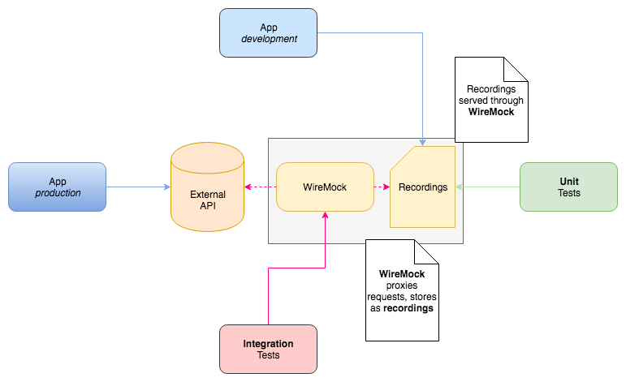

# Example WireMock Recorder

This is a proof of concept to show how [WireMock](http://wiremock.org/) can be used to manage connections to a third party server in a way that maximizes the conformity to its API while reducing the dependency of the code to it for tasks such as testing and local development

## Goals

- Confirm that the connection to the Third Party Server works through an automated test
- Have unit tests that do not rely on external resources, but that use mock data using an external source
- Have a way to easily refresh the test data in an automated way, to confirm that the mock data is compatible with the source
- Use the same mocks for local development without any extra configuration or dependencies needed

This is a diagram how it all ties together



## App

The app exposes two routes

```
/todos
/todos/:id
```

They go against a [real API](https://jsonplaceholder.typicode.com) 

### Development mode

the development serve runs against pre-recorded mocks that are stored in the repo. The mocks can be found [here](./src/test/resources/mappings). To start the server in this mode, use `./go run`, which starts it under `localhost:9000`

### Production mode

To run the server using the real integration, use `./go run-production`, which starts the server under `localhost:9001`.

## Tests

There are two test targets available

### Unit tests

these are regular unit tests, that do not any request to the outside. Instead they use the mocks that are stored in the repo. Run the tests with `./go test-unit`.

These tests can be used to test all the functionality of the app while knowing that the test data comes from a real source.

### Integration tests

these are integration tests, that run against the actual API. They can be run with `./go test-integration`.

These tests are not intended to test the functionality of our code in detail, but rather to make sure the integration between our app and the external API is working correctly.

### Why the separation?

Following the [Testing Pyramid](https://martinfowler.com/bliki/TestPyramid.html), we want to have most of our tests at the lowest possible level. In the case of the [JsonPlaceholder](./src/main/java/com/hceris/recorder/JsonPlaceholder.java), testing it requires mocks, as it would otherwise do a network request.

Thanks to _WireMock_, this process is very convenient and almost transparent to the app. The base cases can be tested with mocks that come from a real source. Other scenarios, such as errors, can be explicitly simulated on top.

## Regenerating the mocks

A crucial part of this setup is having an easy, automated way of regenerating the mocks based on real data. Without an alignment between the mocks and the actual integrated environment, our unit tests are a lot less meaningful, as they might be testing something that does not match reality.

If the process is not at least partially automated, it is less likely that it will be done often, and there is always the possibility of human error.

Luckily _WireMock_ makes this super easy. In fact, we can use our integration tests to produce these recordings directly. We do not do this on every run, to avoid recreating stuff on each run, but rather provide an extra target. By running `./go refresh-recordings`, you will get fresh mock data that can be directly used by unit tests or the local development server. This is the last piece of the puzzle that closes the circle.
