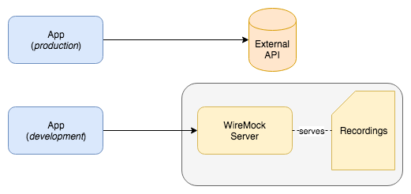

# Example WireMock Recorder

This is a proof of concept to show how [WireMock](http://wiremock.org/) can be used to manage connections to a third party server in a way that maximizes the conformity to its API while reducing the dependency of the code to it for tasks such as testing and local development

## Goals

- Confirm that the connection to the Third Party Server works through an automated test
- Have unit tests that do not rely on external resources, but that use mock data using an external source
- Have a way to easily refresh the test data in an automated way, to confirm that the mock data is compatible with the source
- Use the same mocks for local development without any extra configuration or dependencies needed

## App

The app exposes two routes

```
/todos
/todos/:id
```

They go against a [real API](https://jsonplaceholder.typicode.com) 

### Development mode

the development serve runs against pre-recorded mocks that are stored in the repo. The mocks can be found [here](./src/test/resources/mappings). To start the server in this mode, use `./go run`, which starts it under `localhost:9000`

### Production mode

To run the server using the real integration, use `./go run-production`, which starts the server under `localhost:9001`.

This is a chart of how it looks like



